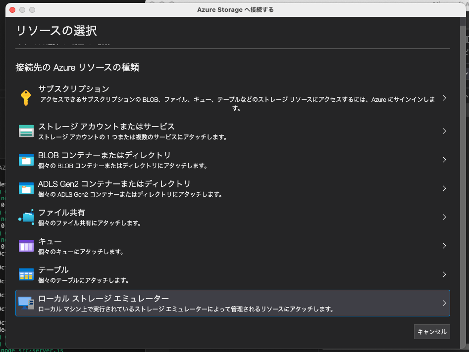
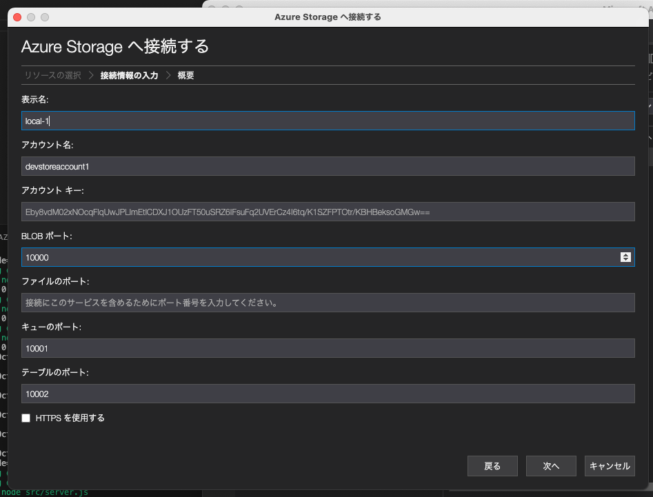
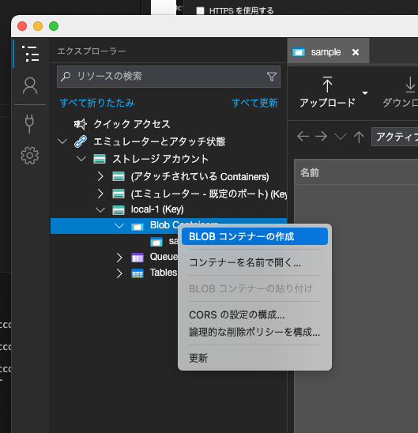
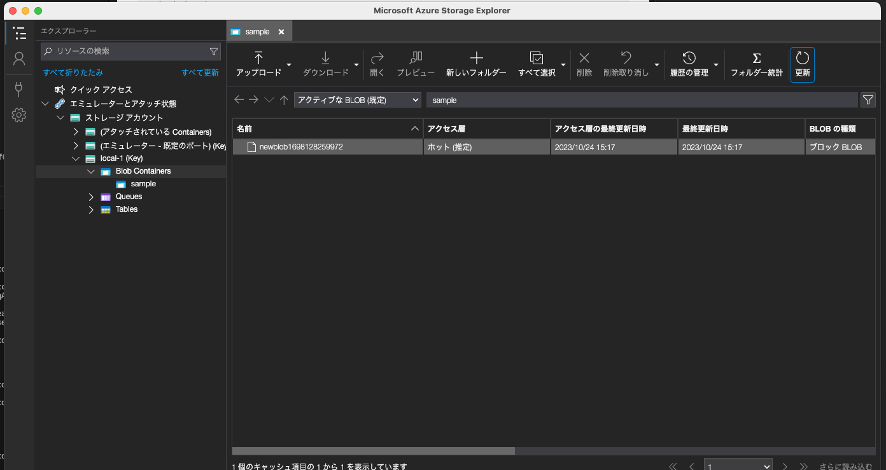

Azureのローカル環境構築テンプレート
===

# 構成

- nodejs
- Azurite（Azure Storageのエミュレーター）

# Azuriteのインストール Docker環境
https://hub.docker.com/_/microsoft-azure-storage-azurite

# Azure Storage Explorer
https://azure.microsoft.com/ja-jp/products/storage/storage-explorer/

# 使用方法

```
docker compose up -d
```

# コンテナ接続

Azure Storage Explorerを起動



デフォルトのままでOK



# コンテナを作成する

sampleという名前でコンテナを作成する



# Blobアップロードテスト

```
docker compose exec node bash
```

# テストスクリプトの実行

```
npm install
```

.envの作成

ローカル接続文字列はそのままでOK

```
cp .env.sample .env
```

```
cd src
node index.js
Azure Blob storage v12 - JavaScript quickstart sample
Upload block blob newblob1698128259972 successfully 1b2f466e-4e68-4b5c-8492-d71358f0a1f3
Done
```

コンテナを更新するとBlobが作成されている



