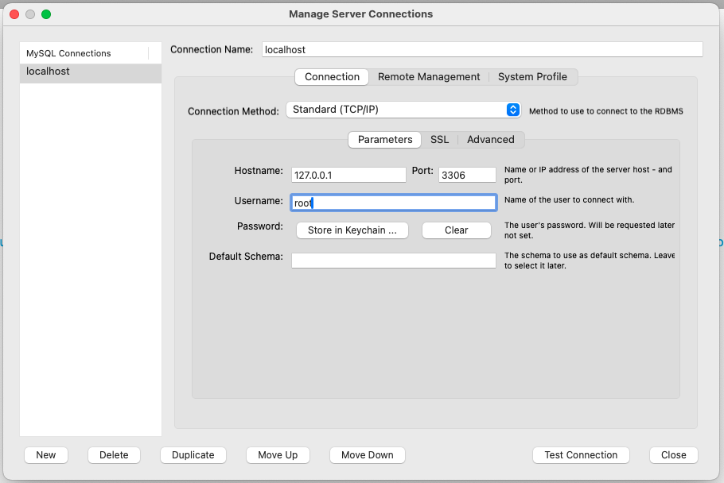
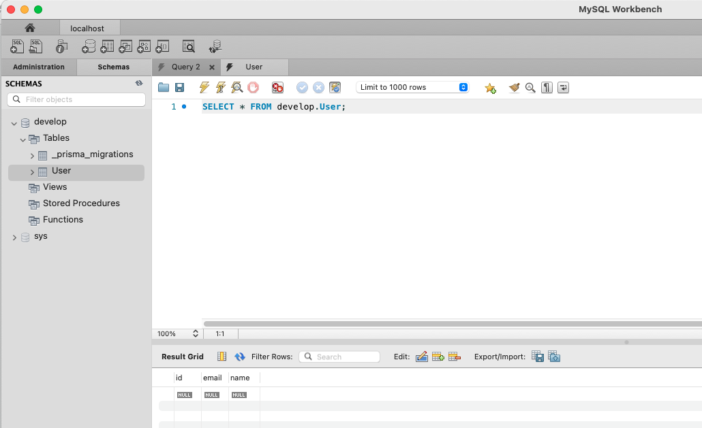

Azureのローカル環境構築テンプレート
===

# 構成

- nodejs
- MySQL(8.0)
- Azurite（Azure Storageのエミュレーター）

# Azuriteのインストール Docker環境
https://hub.docker.com/_/microsoft-azure-storage-azurite

# Azure Storage Explorer
https://azure.microsoft.com/ja-jp/products/storage/storage-explorer/

# 使用方法

```
$ docker compose up -d
```

# Azure コンテナ接続

Azure Storage Explorerを起動


デフォルトのままでOK


# コンテナを作成する

sampleという名前でコンテナを作成する


# Blobアップロードテスト

```
$ docker compose exec node bash
```

# テストスクリプトの実行

```
$ npm install
```

.envの作成

ローカル接続文字列はそのままでOK

```
$ cp .env.sample .env
```

```
$ cd src
$ node blob-test.js

Azure Blob storage v12 - JavaScript quickstart sample
Upload block blob newblob1698128259972 successfully 1b2f466e-4e68-4b5c-8492-d71358f0a1f3
Done
```

コンテナを更新するとBlobが作成されている


# Mysqlへ接続

## mMySQL Workbenchをインストール

https://www.mysql.com/jp/products/workbench/

## 設定



# Nodejsから接続テスト

```
$ docker compose exec node bash
$ cd src
$ npx prisma migrate dev --name init

Environment variables loaded from .env
Prisma schema loaded from prisma/schema.prisma
Datasource "db": MySQL database "develop" at "db:3306"

Applying migration `20231024074859_init`

The following migration(s) have been created and applied from new schema changes:

migrations/
  └─ 20231024074859_init/
    └─ migration.sql

Your database is now in sync with your schema.

...省略

15 packages are looking for funding
  run `npm fund` for details

found 0 vulnerabilities

✔ Generated Prisma Client (v5.4.2) to ./../node_modules/@prisma/client in 80ms
```

マイグレーションが走り、テーブルが作成されていればOK



